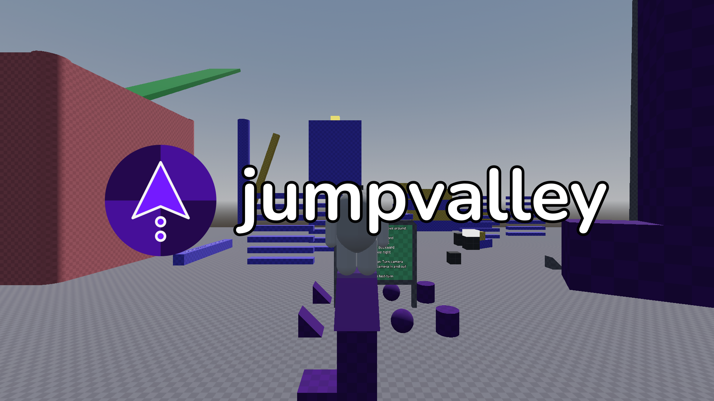

# Jumpvalley



Jumpvalley is both an app and a library you can use to test and run 3D platformer levels! It's being made using the [Godot Engine](https://godotengine.org/).

Currently, Jumpvalley is a work in progress. Some features (such as being able to switch levels within the app) have yet to be implemented. Though if you want to test it, the app can currently load and run a level that's specified to load when the app starts. Additionally, there are some settings you can configure in the app's settings menu.

Jumpvalley also features a "core" API in its repository (this one) that level developers can use to code their levels. The core API also features some classes that can be used to code a 3D platformer app or game.

**Important:** While it is currently possible to make a platformer level in Jumpvalley with the Godot Editor, backwards-compatibility is subject to being broken while Jumpvalley is still in major version zero (0.x.x). This is because level formatting and behavior hasn't been set in stone yet. If you want to prevent your level from being broken between minor versions, please wait until Jumpvalley has reached major version one (1.0.0).

## Credits

The ```addons``` folder in this repository's root contains assets made by 3rd-parties. They're super useful in this project because not only do I not have the skill, time, and/or resources to make a lot of these assets, but they also allow me to speed up development and testing using resources that the creators of these assets have allowed the public to use.

A list of such assets that are used in this project can be found [here](https://github.com/UTheCat/jumpvalley/blob/main/credits.md).

### Inspirations

Jumpvalley was inspired by several fun platformers that you should check out, including:

- [Celeste](https://www.celestegame.com/)
- [Eternal Towers of Hell](https://www.roblox.com/games/8562822414/Eternal-Towers-of-Hell)
- [Flood Escape 2](https://www.roblox.com/games/738339342/Flood-Escape-2)

## Licensing

This project's source code is licensed under the MIT License. The source code's license can be found [here](https://github.com/UTheCat/jumpvalley/blob/main/LICENSE.md).

Assets under the ```addons``` folder are 3rd-party assets. As such, they are covered by different licenses (especially since they were made by other individuals).

## Running the app

If you're looking to simply run Jumpvalley, you can find the app precompiled in the [releases](https://github.com/UTheCat/jumpvalley/releases) tab.

Jumpvalley currently doesn't have an installer executable. Therefore, downloading the compressed folder corresponding to your device's operating system, and then extracting it, should give you the files needed to run precompiled Jumpvalley.

### Jumpvalley for Android

To test its functionality on mobile platforms, Jumpvalley can be run on Android. While there are precompiled versions of Jumpvalley for Android, Android support is currently *experimental* for these reasons:
- Currently, exporting an app with C# code to an Android APK on Godot 4 is itself an experimental feature
- Currently, you'll need to connect a keyboard and mouse to your Android device in order to move your character and camera.

### Jumpvalley for Linux

The releases tab contains Jumpvalley precompiled for Linux systems. As of version 0.6.0, Jumpvalley for Linux is shipped in `.tar.xz` archives.

The Jumpvalley executable for the Linux version of Jumpvalley is named `jumpvalley` (with no file extension).

#### Allowing the system to run Jumpvalley

In later versions of Jumpvalley, the executable should already have the necessary permissions to run after you've extracted the archive that it's contained in.

In case the Jumpvalley executable doesn't run, you might need to grant the needed permissions for the executable to run. To do this, open the Linux terminal, change the working directory to the directory containing the Jumpvalley executable like this:

`cd [path to the directory with the Jumpvalley executable]`

and type this command:

`chmod +x jumpvalley`

The above command should tell Linux to allow running the Jumpvalley executable.

#### Wayland and X11

Jumpvalley uses X11/XWayland by default. If you'd like the app to run on Wayland instead, then in the directory where the Jumpvalley executable is located, run this command:

`./jumpvalley --display-driver wayland`

The above command assumes that the Jumpvalley executable kept its original name, `jumpvalley`.

### Jumpvalley for Windows

Running Jumpvalley on Windows is simple. Extract the `.zip` file containing the Windows version of Jumpvalley, open the resulting folder, and run `jumpvalley.exe` contained inside the folder.

## Documentation

Jumpvalley's documentation can be found on its [website](https://uthecat.github.io/jumpvalley-docs/) hosted on GitHub.

## Found a bug in Jumpvalley?

Feel free to open an issue on this repository describing the bug.

## Working with this repository

Thank you for your interest in the Jumpvalley project! Here's some info on what you could do with a copy of the Jumpvalley repository on your system, the software you'll need for working with the repository, and how to play-test the repository.

### With the repository, you could

- experiment with making a 3D platformer level using Jumpvalley and Godot (please note that the behavior of Jumpvalley is still subject to change; levels may break across updates until Jumpvalley has reached at least version 1.0.0).
- contribute to the Jumpvalley project
- make something else with the code entirely; the choice is yours!

### Prerequisites

Software you'll need:
- .NET-Enabled Godot v4.4 or later. The latest version of .NET-Enabled Godot 4 is preferred, and can be downloaded from [Godot's official download page](https://godotengine.org/download).
- The [.NET 8 SDK](https://dotnet.microsoft.com/download)
- [Visual Studio Code](https://code.visualstudio.com/) with the [C# extension](https://marketplace.visualstudio.com/items?itemName=ms-dotnettools.csharp) (if you want to work with the project's source code)

### Level development using Jumpvalley and Godot

Developing a level that you can run in Jumpvalley is currently done by downloading a copy of this repository to your computer, opening it using the Godot Engine, and using the Godot Engine (as well as other 3rd-party tools) to make the level. Documentation for doing so is still in development, but the [Jumpvalley Docs site](https://uthecat.github.io/jumpvalley-docs/) has some info you could use to get started if you'd like.

### Running Godot and this repository's project file

Open your copy of this repository's ```project.godot``` file in the version of Godot specified in the prerequisites above.

In order to run the project, there's a play button near the top-right corner of the window. Click it to run the project.

### Debugging with Visual Studio Code

If you're working in Visual Studio Code, Jumpvalley has a launch configuration named `Debug Jumpvalley` that you can use to debug Jumpvalley. This will allow you to see the app's console output.

Just make sure you have an environment variable named `JUMPVALLEY_GODOT_EXECUTABLE` set to the path to the Godot executable as mentioned in the prerequisites, and you should be able to run the launch configuration.

Additionally, if you make any changes to the app's code (particularly, the C# code), you'll have to rebuild the project. This can be done by opening the project in Godot and clicking the hammer icon at the top-right corner of the window. (Note: If you don't see this icon, which should be next to the play button in the Godot window, check to see that you installed .NET properly and that `project.godot` points to the correct C# assembly file.)
