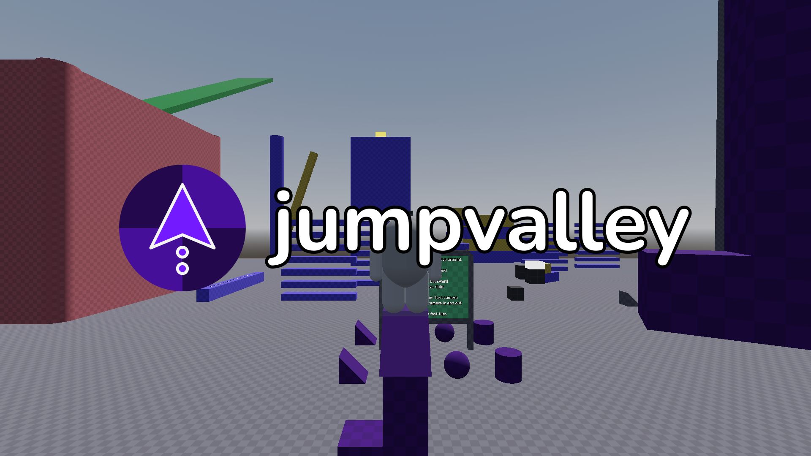

# Jumpvalley



Jumpvalley is both an app and a library you can use to test and run 3D platformer levels! It's being made using the [Godot Engine](https://godotengine.org/).

Currently, Jumpvalley is a work in progress. Some features (such as being able to switch levels within the app) have yet to be implemented. Though if you want to test it, the app can currently load and run a level that's specified to load when the app starts. Additionally, there are some settings you can configure in the app's settings menu.

Jumpvalley also features a "core" API in its repository (this one) that level developers can use to code their levels. The core API also features some classes that can be used to code a 3D platformer app or game.

**Important:** While it is currently possible to make a platformer level in Jumpvalley with the Godot Editor, backwards-compatibility is subject to being broken while Jumpvalley is still in major version zero (0.x.x). This is because level formatting and behavior hasn't been set in stone yet. If you want to prevent your level from being broken between minor versions, please wait until Jumpvalley has reached major version one (1.0.0).

## Credits

### 3rd-party asset usage

The `addons` folder in this repository's root contains 3rd-party assets (meaning the assets were made by other individuals). These beautiful assets used by this project are listed in [CREDITS.md in this repository's root](CREDITS.md).

### Inspirations

Jumpvalley was inspired by several fun platformers that you should check out, including:

- [Celeste](https://www.celestegame.com/)
- [Eternal Towers of Hell](https://www.roblox.com/games/8562822414/Eternal-Towers-of-Hell)
- [Flood Escape 2](https://www.roblox.com/games/738339342/Flood-Escape-2)

## Licensing

This project's source code is licensed under the [MIT License](https://choosealicense.com/licenses/mit/). The source code's license can be found in [LICENSE.md in the repository's root](LICENSE.md).

Assets under the ```addons``` folder are 3rd-party assets. As such, they are covered by different licenses (especially since they were made by other individuals).

## Running the app

If you're looking to simply run Jumpvalley, you can find the app precompiled in the [releases](https://github.com/UTheCat/jumpvalley/releases) page.

Jumpvalley currently doesn't have an installer executable. Therefore, downloading the compressed folder corresponding to your device's operating system, and then extracting it, should give you the files needed to run precompiled Jumpvalley.

### Jumpvalley for Android

To download and run Jumpvalley on Android:
1. Download the Jumpvalley APK file from the [releases](https://github.com/UTheCat/jumpvalley/releases) page
2. Follow the relevant instructions for your Android device to install the Jumpvalley APK file
3. Run the app

**Important:** Android support is currently *experimental* for these reasons:

- Currently, you'll need to connect a keyboard and mouse to your Android device in order to move your character and camera.
- Exporting an app with C# code to an Android APK on Godot 4.6 is itself an experimental feature.

### Jumpvalley for Linux

To download and run Jumpvalley on Linux:

1. Download the Linux `.tar.xz` or `.zip` archive containing Jumpvalley on the [releases](https://github.com/UTheCat/jumpvalley/releases) page.
    - Versions 0.6.0 and above are packaged in `.tar.xz` archives
    - Versions before 0.6.0 are packaged in `.zip` archives.
2. Extract the archive, and open the resulting folder
3. Run the executable file named `jumpvalley` (with no file extension) contained inside. This is the Jumpvalley executable.

#### Allowing the system to run Jumpvalley

On Linux systems, executable files must be granted permission to run code.

This should be handled automatically for Jumpvalley version 0.6.0 and above because these versions of Jumpvalley are packaged in `.tar.xz` archives.

If the Jumpvalley executable fails to run, follow these instructions to grant code execution privileges to the Jumpvalley executable:

1. Open a terminal session in the folder where the Jumpvalley executable is located. This can be done with the following command:

`cd [path to folder with Jumpvalley executable]`

2. Grant code execution privileges to the Jumpvalley executable using this command:

`chmod +x ./jumpvalley`

- This command assumes that the Jumpvalley executable kept its original name, `jumpvalley`.

#### Wayland and X11

Jumpvalley uses Wayland by default to take advantage of newer technologies implemented in popular Linux desktop environments (such as GNOME and KDE).

Jumpvalley can also run on XWayland or X11 instead, which may help fix compatiblity issues. To do this, open a terminal session in the folder where the Jumpvalley executable is located, and run this command:

`./jumpvalley --display-driver x11`

This assumes that the Jumpvalley executable kept its original name, `jumpvalley`.

Additionally, if your current desktop environment is running on X11, Jumpvalley should automatically use X11 as well.

### Jumpvalley for Windows

To download and run Jumpvalley on Windows:
1. Download the Windows zip archive containing Jumpvalley on the [releases](https://github.com/UTheCat/jumpvalley/releases) page.
2. Extract the `.zip` file containing the Windows version of Jumpvalley, and open the resulting folder
3. Run `jumpvalley.exe` contained inside the folder.

## Documentation

Jumpvalley's documentation can be found on its [website](https://uthecat.github.io/jumpvalley-docs/) hosted on GitHub.

## Found a bug in Jumpvalley?

Feel free to [open an issue on this repository](https://github.com/UTheCat/jumpvalley/issues/new) describing the bug.

## Working with this repository

Thank you for your interest in the Jumpvalley project! Here's some info on what you could do with a copy of the Jumpvalley repository on your system, the software you'll need for working with the repository, and how to play-test the repository.

### Some things you could do with the repository

- Experiment with making a 3D platformer level using Jumpvalley and Godot (please note that the behavior of Jumpvalley is still subject to change; levels may break across updates until Jumpvalley has reached at least version 1.0.0).
- Contribute to the Jumpvalley project.
- Use Jumpvalley's code to make your own separate app or game.
    - If you would like to use Jumpvalley's Core API in your project as-is, please see the *"Using the Jumpvalley Core API in your own project"* section at the bottom of this README.

### Prerequisites

Software you'll need:
- .NET-Enabled Godot v4.6 or later. The latest version of .NET-Enabled Godot 4 is preferred, and can be downloaded from [Godot's official download page](https://godotengine.org/download).
- The [.NET 10 SDK](https://dotnet.microsoft.com/download)
- [Visual Studio Code](https://code.visualstudio.com/) with the [C# extension](https://marketplace.visualstudio.com/items?itemName=ms-dotnettools.csharp) (if you want to work with the project's source code)

### Level development using Jumpvalley and Godot

Developing a level that you can run in Jumpvalley is currently done by downloading a copy of this repository to your computer, opening it using the Godot Engine, and using the Godot Engine (as well as other 3rd-party tools) to make the level. Documentation for doing so is still in development, but the [Jumpvalley Docs site](https://uthecat.github.io/jumpvalley-docs/) has some info you could use to get started if you'd like.

### Running Godot and this repository's project file

Open your copy of this repository's ```project.godot``` file in the version of Godot specified in the prerequisites above.

In order to run the project, there's a play button near the top-right corner of the window. Click it to run the project.

### Debugging with Visual Studio Code

If you're working in Visual Studio Code, Jumpvalley has a launch configuration named `Debug Jumpvalley` that you can use to debug Jumpvalley. This will allow you to see the app's console output.

Just make sure you have an environment variable named `JUMPVALLEY_GODOT_EXECUTABLE` set to the path to the Godot executable as mentioned in the prerequisites, and you should be able to run the launch configuration.

Additionally, if you make any changes to the app's code (particularly, the C# code), you'll have to rebuild the project. This can be done by opening the project in Godot and clicking the hammer icon at the top-right corner of the window. (Note: If you don't see this icon, which should be next to the play button in the Godot window, check to see that you installed .NET properly and that `project.godot` points to the correct C# assembly file.)

## Using the Jumpvalley Core API in your own project

The Jumpvalley Core API was designed with the goal that the API could be used for projects other than the Jumpvalley app. While the API should work for external projects, the Jumpvalley Core API has **not** been tested for projects other than the Jumpvalley app (found in this repository). Additionally, the Jumpvalley Core API is currently **not** considered stable.

However, if you would still like to include the Jumpvalley Core API as a third-party library in your own project:
1. Copy the `src/core` directory under this repository's root into your own project's directory or repository.
    - You may need to create another directory within your project (to paste the `src/core` directory into) if there are directory-naming conflicts.
2. If necessary, rename the newly copied folder to distinguish the Jumpvalley Core API from the rest of your project.
3. Update the relevant `*.csproj` files to recognize the Jumpvalley Core API so that the API can be used in your C# code.
